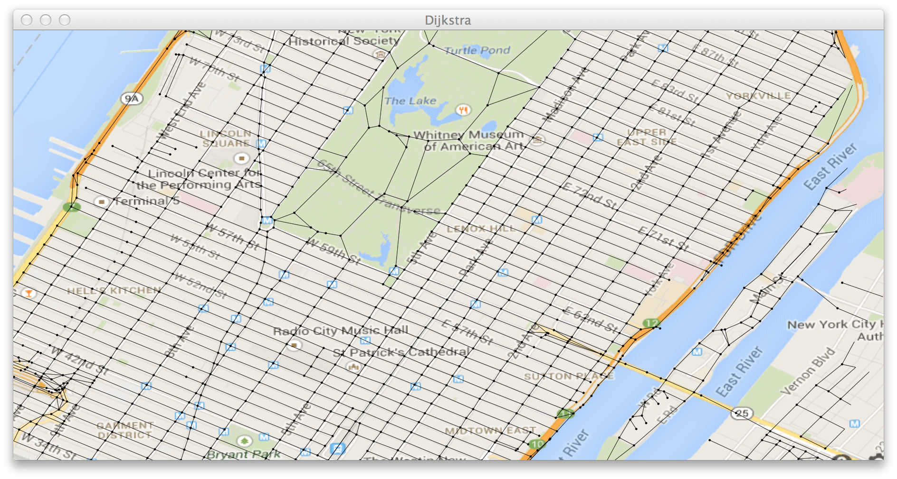
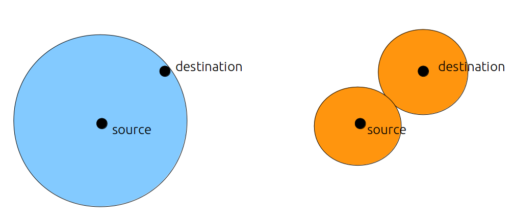
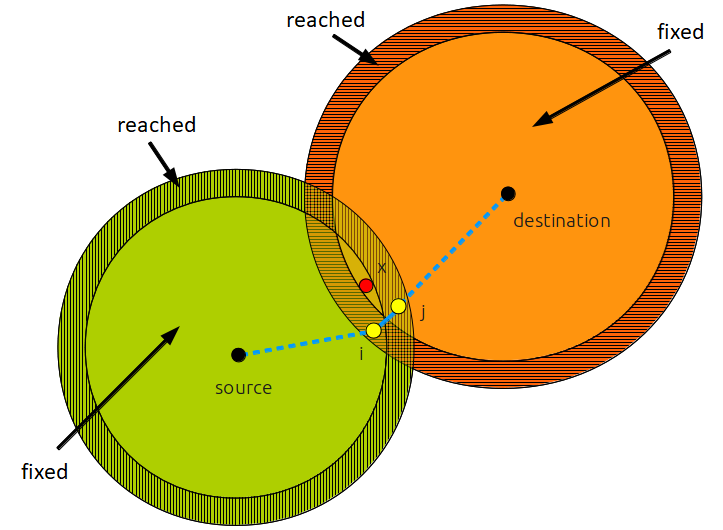

# Finding the shortest path in New York

In this homework, the problem is to use Dijkstra's algorithm to find the shortest path with a large graph.
The file `data/USA-road-d-NY.gr` contains the topology of the graph in the following image :


It contains 264346 vertices and 733846 edges.

**Note : this is just an image showing the topology, you're not going to see this in c++.**

Description of the struct
------------------------
`struct Node` defines a vertices, with its distance to a certain vertex.

`struct Graph` defines a generic graph, and contains the method `int shortestPath(V source, V destination, map<V, int>& distances)` that
we saw in the lecture. The return value is modified so that it returns the number of iterations needed.


Exercise 1
------------------------
Test the environment by running, in `main()`,
```
Graph<int> g;
readGraph("data/USA-road-d-NY.gr", g);

int source = 190635, destination = 187333;

g.shortestPath(source, destination); //forward search
g.shortestPath(destination, source); //backward search
```

You should see the following result :
```
reading graph...    
done.

Distance : 46834 in 1826 steps.
Distance : 46834 in 2405 steps.
```

Here, forward search means that we use Dijsktra's algorithm starting from `source`, and stops when `destination` is in `visited`.
Conversely, backward search means that we start from `destination`.

This graph is a non-oriented graph, that's why the distance from `source` to `destination` is the same as from `destination` to `source`.
Basically, if edge (a, b) exists, then so does (b, a), and they have the same weight.

Exercise 2
-----------------------
The original Dijkstra seems good enough, in that it found the distance already fast. However, since `source` and `destination` plays
exactly the same role (important : this is only true in a **non-oriented** graph), we can actually use *two* Dijkstra algorithms, one
starting from `source` and the other starting from `destination`. We call it **bidirectional Dijkstra**.

The original Dijkstra draws concentric circles centered in `source`, and increases the radius gradually, until `destination` is included
in the circle.

In bidirectional Dijkstra, two groups of circles, centerd in `source` and `destination`, increase their sizes using the original Dijkstra,
and the algorithm finishes when the two circles intersect.

The algorithm is illustrated below : 


where the left image describes the original Dijkstra, and the right describes bidirectional Dijkstra.

fill in `void Graph<V>::shortestPath_bi(V source, V destination)`. Conserve the last line `cout<<"Distance : "<<d<<" in "<<i<<" steps."<<endl;`
in the method to output the result. `d` should be set to the distance between `source` and `destination`, and `i` set to the number of
iterations.

Hint : to make sure that the two circles grow at the same rate, perform Dijkstra alternately on the *forward* queue (starting from `source`
) and on the *backward* queue (from `destination`).
For example,
```
//initialize the queues, distances, visiteds,... for the two groups here

int i=0;
while(!termination condition){
    if(i%2==0){
        //perform Dijsktra for 1 step on the forward queue
    } else {
        //perform Dijsktra for 1 step on the backward queue
    }
    i++;
}
```
To determine the `termination condition`, you must keep track of the last node visited, and if it's in both `visited`s, terminate the algorithm.

Once finished, run, in `main()`,

```
readGraph("data/USA-road-d-NY.gr", g);

int source = 190635, destination = 187333;

g.shortestPath(source, destination); //forward search
g.shortestPath(destination, source); //backward search
g.shortestPath_bi(source, destination); //bidirectional search
```
You should see the following result :
```
reading graph...    
done.

Distance : 46834 in 1826 steps.
Distance : 46834 in 2405 steps.
Distance : 46834 in 1119 steps.
```

Depending on how you count the iterations, the number of steps might be different, but it should be roughly half of that of the original Dijkstra.

Now, change the source and the destination, and run again :
```
int source = 190637, destination = 187334;
```

What do you observe?

Exercise 3
------------------
Actually, the above algorithm is not totally correct. Look at the following image :

